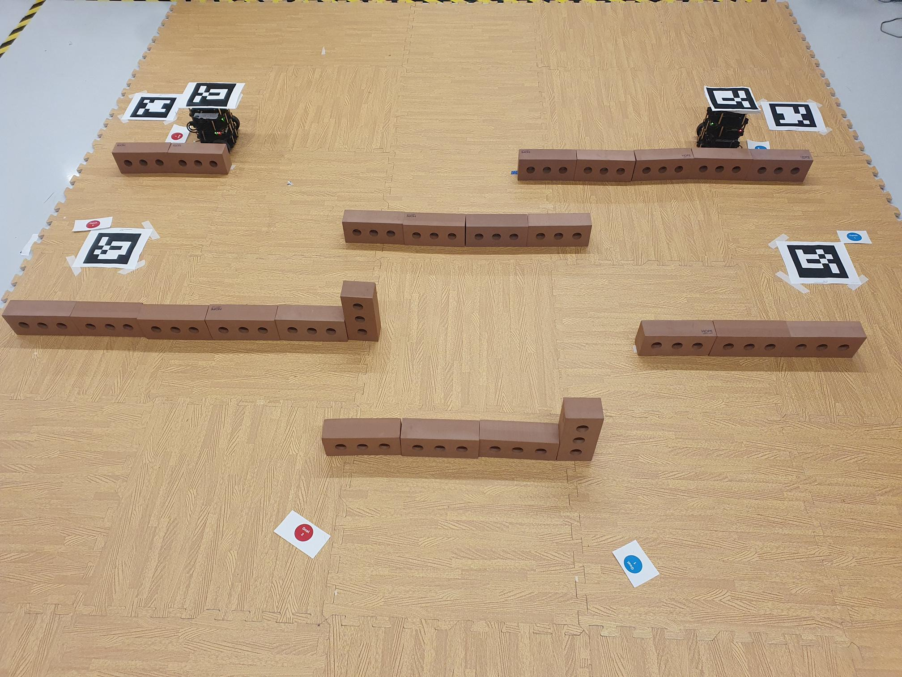
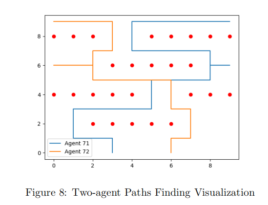

# Unmanned Warehouse Multi-Agent TurtleBot System

## Overview

This repository presents an unmanned warehouse management prototype built around two TurtleBot3 Burger robots, with simulation support for larger multi-agent scenes. The system models a fetch-and-deliver workflow: both robots start from assigned starting positions, navigate through an obstacle-filled warehouse arena, visit their respective Fetch Points identified by ArUco markers, and continue toward goal positions while avoiding robot-robot and robot-obstacle collisions.

The project combines real TurtleBot experiments with PyBullet simulation. It explores single-agent and multi-agent navigation, A* path planning, Conflict-Based Search (CBS), proportional/PID-style motion control, camera calibration, ArUco marker pose estimation, and the transfer of planned simulation waypoints into a physical arena.

<p align="center">
  
</p>

<p align="center">
  
</p>

## What This Project Does

- Coordinates TurtleBot agents in a warehouse-style environment with shelves, narrow aisles, Fetch Points, and final destinations.
- Uses A* as the low-level planner for shortest-path search on a grid map.
- Uses CBS as the high-level multi-agent planner to resolve vertex and edge conflicts between robots.
- Converts planned grid schedules into TurtleBot wheel commands for simulation execution.
- Uses ArUco markers for real-world pose estimation, including robot and destination marker tracking.
- Includes ROS launch/configuration files for TurtleBot navigation, obstacle avoidance, ArUco detection, and move_base/DWA navigation.
- Provides PyBullet scenes for testing single-agent, two-agent, and larger multi-agent scenarios.

## System Pipeline

1. Define the warehouse map, obstacles, starts, Fetch Points, and goals in YAML scene files.
2. Run the path planner:
   - A* finds each robot's shortest local route.
   - CBS detects collisions and adds constraints until all robot paths are conflict-free.
3. Export the resulting schedule to `output.yaml`.
4. Execute the planned route in PyBullet using TurtleBot URDF models and warehouse obstacle assets.
5. Transfer the navigation logic into a real arena using camera calibration and ArUco marker pose topics.
6. Validate single-agent and multi-agent fetch-and-deliver runs in both simulation and physical tests.

## Key Components

### Path Planning

The planner is implemented in `turtlebot_simulation_pybullet/cbs/`.

- `a_star.py` implements low-level A* search using Manhattan-distance heuristics.
- `cbs.py` implements Conflict-Based Search with vertex constraints and edge constraints, allowing multiple robots to share a map without occupying the same cell or swapping positions at the same time step.

### PyBullet Simulation

The PyBullet simulation in `turtlebot_simulation_pybullet/` builds warehouse scenes from URDF obstacle assets, loads TurtleBot models, runs CBS planning, and drives robots through their schedules with wheel velocity control.

Useful entry points include:

- `multi_robot_navigation.py`
- `multi_robot_navigation_2.py`
- `multi_robot_navigation_3.py`
- `multi_robot_navigation_deliver.py`
- `final_challenge.py`

### ROS TurtleBot Navigation

The ROS workspace in `turtlebot3_burger_auto_navigation/` contains launch files and parameters for:

- ArUco marker detection with marker IDs such as `100` and `101`.
- Autonomous navigation from robot marker pose to target marker pose.
- TurtleBot3 Burger move_base navigation using DWA local planning.
- Naive and multi-robot obstacle avoidance experiments.

## Results Showcase

### Path Search

<p align="center">
  
</p>

### Simulation

<p align="center">
  
</p>

### Physical Arena

<p align="center">
  <video src="assests/videos/physical_arena_video.mp4" controls width="850"></video>
</p>

## Installation

For the PyBullet simulation:

```bash
cd turtlebot_simulation_pybullet
python3 -m pip install -r requirement.txt
```

The main Python dependencies are:

- `pybullet`
- `pyyaml`
- `numpy`
- `matplotlib`
- `scipy`
- `ffmpeg-python`

For the ROS/TurtleBot side, use an Ubuntu/ROS environment compatible with TurtleBot3 Burger, `move_base`, `dwa_local_planner`, `usb_cam`, and `aruco_ros`.

## Running the Simulation

From the simulation directory:

```bash
cd turtlebot_simulation_pybullet
python3 multi_robot_navigation_deliver.py
```

To run CBS directly on an input YAML file:

```bash
cd turtlebot_simulation_pybullet
python3 -m cbs.cbs input.yaml output.yaml
```

Scene files are stored under `turtlebot_simulation_pybullet/scene/`, including warehouse layouts for one robot, two-stage tasks, four robots, and final challenge experiments.

## Report

The full technical report is available here:

[Download the PDF report](assests/Multi_agent_System%20Report-1.pdf)

The report documents the methodology and results in detail, including navigation strategies, camera calibration, TurtleBot3 setup, simulation setup, Fetch Point design, real arena integration, PID control ideas, SLAM/map experiments, and final results analysis.

## Report Preview

<p align="center">
  
  
  
  
  
  
  
  
  
  
  
  
  
  
  
  
  
  
  
  
  
  
  
  
  
  
  
  
  
  
  
  
  
  
  
  
</p>
